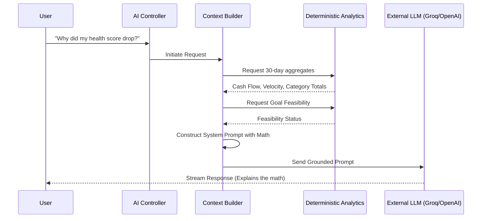

# Grounded AI Architecture

Traditional AI finance wrappers share a fatal flaw: they pass raw transactional data into Large Language Models (LLMs) and ask the model to perform mathematical aggregations. **LLMs are language models, not calculators.** This leads to "hallucinations"—incorrect math presented with extreme confidence.

FinSight fundamentally solves this problem using a strictly grounded, deterministic AI pipeline.

## The AI Pipeline



## How It Works

When a user asks a question, the following pipeline executes:

1. **Interception**: The request is intercepted by the backend AI service.
2. **Deterministic Aggregation**: The backend queries the database and runs exact, integer-based mathematical calculations (e.g., "Food spending increased by 14% compared to last month").
3. **Context Injection**: These exact mathematical facts are injected into a highly constrained System Prompt.
4. **LLM Generation**: The LLM is instructed *never* to perform calculations. Its only job is to analyze the pre-calculated facts and explain them to the user in natural language.

### Example Context Injection

```text
SYSTEM:
You are FinSight AI. Analyze the user's query based ONLY on the following deterministic facts:
- Current Health Score: 68
- Total Cash Flow (30d): +$1,200
- Highest Velocity Category: Dining ($45/day)
- Unrealistic Goals: "Emergency Fund" requires $500/mo, but free cash flow is only $200.

Do NOT perform math. Explain the insights.
```

## Privacy First

FinSight does not rely on a centralized, proprietary AI service. Users must supply their own API keys (e.g., Groq or OpenAI) which are securely encrypted using `AES-256-GCM` before being stored in the database. 

Because the context builder only sends aggregated summaries rather than raw rows of thousands of transactions, payload sizes are kept incredibly small, ensuring fast inference and maximum data minimization.
