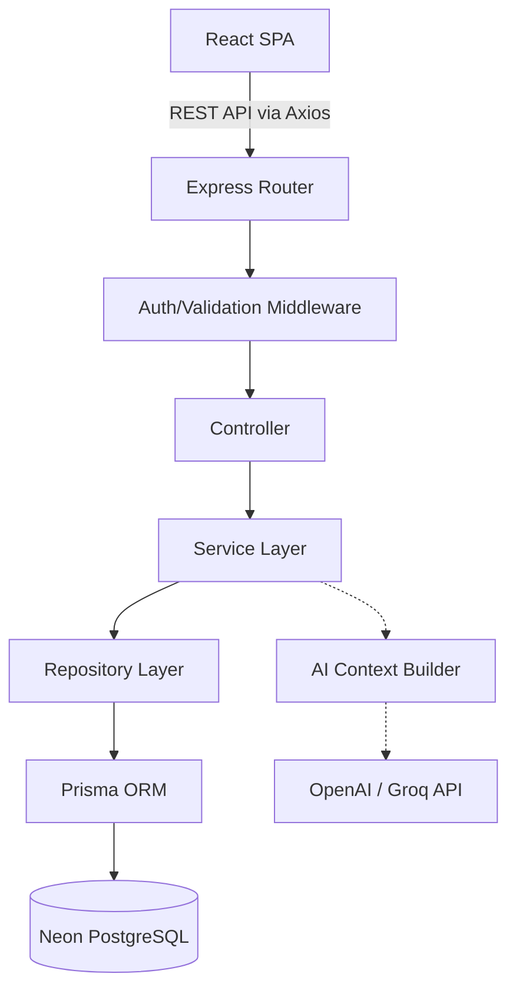

# Architecture

FinSight adopts a strictly layered architecture on the backend and a component-driven architecture on the frontend. This ensures a clean separation of concerns, high testability, and extreme maintainability.

## System Overview

## Backend: Controller-Service-Repository Pattern

To ensure business logic is decoupled from HTTP transport and database queries, the backend uses a strict 3-tier architecture:

### 1. Controllers
- **Responsibility:** Handle HTTP requests and responses.
- **Rules:** 
  - Never interact directly with Prisma.
  - Never contain business logic.
  - Responsible for parsing `req.body`, extracting `req.user`, calling the service layer, and returning standard JSON responses.

### 2. Services
- **Responsibility:** Core business logic and deterministic calculations.
- **Rules:**
  - Independent of Express (no `req` or `res` objects).
  - Handles the math (e.g., calculating the health score).
  - Orchestrates multiple repositories if a complex operation is required.

### 3. Repositories
- **Responsibility:** Data access layer.
- **Rules:**
  - The only layer allowed to import and use the Prisma Client.
  - Encapsulates complex Prisma queries into descriptive, reusable methods.

## Frontend Architecture

The frontend is a React 19 Single Page Application built with Vite.

### State Management Strategy
We employ a bifurcated state management approach to minimize unnecessary re-renders:
1. **Server State (`TanStack Query`)**: Handles all async data fetching, caching, synchronization, and optimistic UI updates for transactions, goals, and analytics.
2. **Client State (`Zustand`)**: Handles global ephemeral UI state (e.g., Presentation Mode toggle, Sidebar states, Theme settings) with strict selective subscriptions.

### Component Hierarchy
- **`pages/`**: Routable container components that orchestrate data fetching.
- **`features/`**: Domain-specific components (e.g., `features/transactions`, `features/goals`). This colocation pattern prevents the global `components/` directory from becoming a monolithic dumping ground.
- **`components/ui/`**: Generic, highly reusable presentation components (buttons, modals, inputs).

## Mathematical Precision

> [!WARNING]
> Floating-point arithmetic in JavaScript can lead to precision loss (e.g., `0.1 + 0.2 = 0.30000000000000004`). 

To completely eliminate precision loss, FinSight stores all currency values as **minor units (integers)** in the PostgreSQL database. 
- Example: `$10.50` is stored as `1050`.
- The frontend transforms these integers back into standard currency formats strictly at the presentation layer using the `formatMoney` utility located in the shared workspace.
