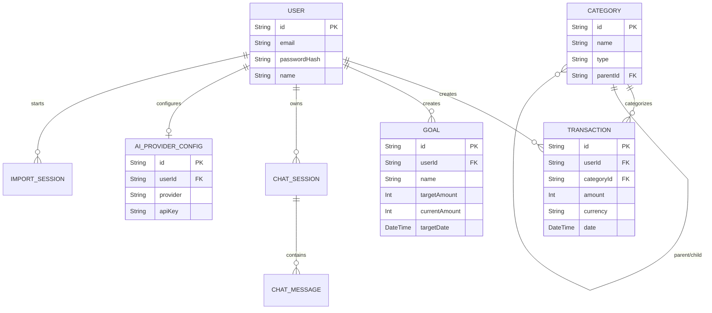

# Database Architecture

FinSight relies on a highly normalized relational database to ensure data integrity and query efficiency. We utilize **PostgreSQL** (hosted via Neon) and the **Prisma ORM** for schema management and type-safe data access.

## Entity-Relationship Diagram

## Key Architectural Decisions

### 1. Absolute Precision (Minor Units)
Currency values are *never* stored as floats or decimals. They are stored as integers representing minor units (e.g., cents). 
- `Int amount` in the `Transaction` table.
- A purchase of `$1,250.50` is stored as `125050`. 
- This mathematically guarantees zero floating-point precision loss during aggregations (sums, averages).

### 2. Category Normalization
Categories are decoupled from users. Standard categories (Food, Rent, Transport) are global entities. This allows the backend to perform powerful, cross-user trend analytics if needed, and prevents database bloat. 

### 3. Cascading vs. Restrictive Deletes
- **Cascade**: Deleting a `User` cascades and deletes all their `Transactions`, `Goals`, and `ChatSessions` to ensure data compliance.
- **Restrict**: Deleting a `Category` is restricted if transactions are still linked to it, ensuring historical data integrity is never broken.

### 4. Query Indexing
Prisma applies strategic `@@index` markers on foreign keys (`userId`, `categoryId`) and temporal fields (`date`) to guarantee lightning-fast aggregations for the Dashboard and AI Context Builder.
