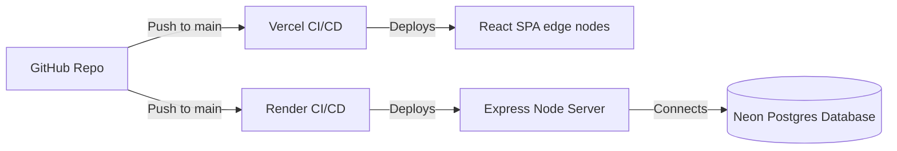

# Deployment Architecture

FinSight is designed for modern cloud infrastructure, utilizing serverless concepts on the frontend and scalable containers on the backend.

## Official Supported Platforms

- **Frontend**: Vercel
- **Backend**: Render (Web Service)
- **Database**: Neon (Serverless PostgreSQL)

## Deployment Pipeline

## 1. Database Configuration (Neon)
Neon provides a scalable, serverless PostgreSQL instance.
1. Create a project on [Neon](https://neon.tech/).
2. Retrieve the pooled connection string.
3. It should look like: `postgresql://[user]:[password]@[host]/[dbname]?sslmode=require`

## 2. Backend Deployment (Render)
Render is ideal for hosting Node.js applications with native websockets and streaming support.
1. Connect your repository to Render.
2. Create a new **Web Service**.
3. **Build Command**: `pnpm install && pnpm build`
4. **Start Command**: `pnpm start` (Make sure your `package.json` has a `start` script pointing to `dist/app.js`).
5. **Environment Variables**:
   - `NODE_ENV`: `production`
   - `DATABASE_URL`: Your Neon string
   - `JWT_SECRET`: Generate a secure 64-character random hex string.
   - `ENCRYPTION_KEY`: Generate a secure **32-byte hex string** (must be exactly 64 characters in hex) for AES-256-GCM.
   - `FRONTEND_URL`: The domain where your Vercel app will live (e.g., `https://finsight-app.vercel.app`).

## 3. Frontend Deployment (Vercel)
Vercel perfectly handles Vite builds and edge caching.
1. Connect your repository to Vercel.
2. Ensure the Framework Preset is set to **Vite**.
3. **Build Command**: `pnpm build`
4. **Environment Variables**:
   - `VITE_API_URL`: The URL of your Render backend (e.g., `https://finsight-api.onrender.com/api`).
5. Deploy.

> [!IMPORTANT]
> CORS Configuration: Ensure the backend `FRONTEND_URL` environment variable perfectly matches the deployed Vercel domain (without a trailing slash), or the browser will block all API requests.
